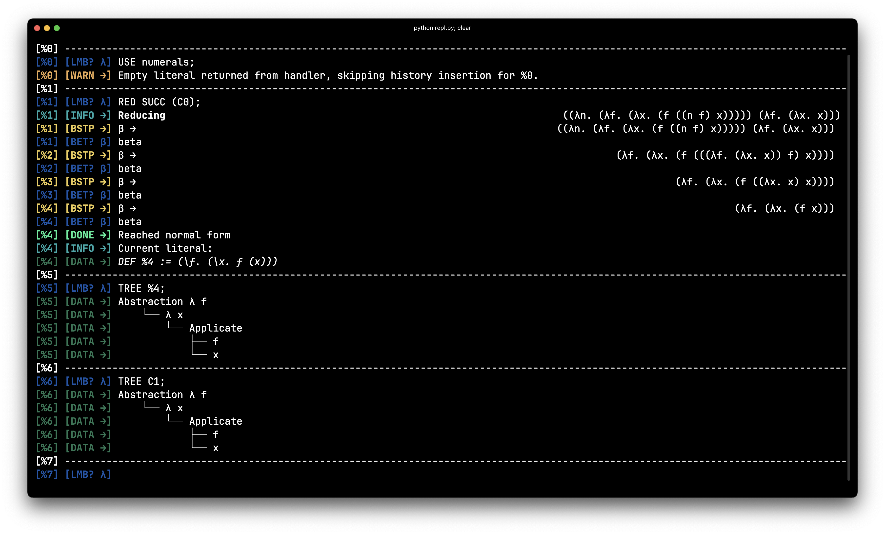
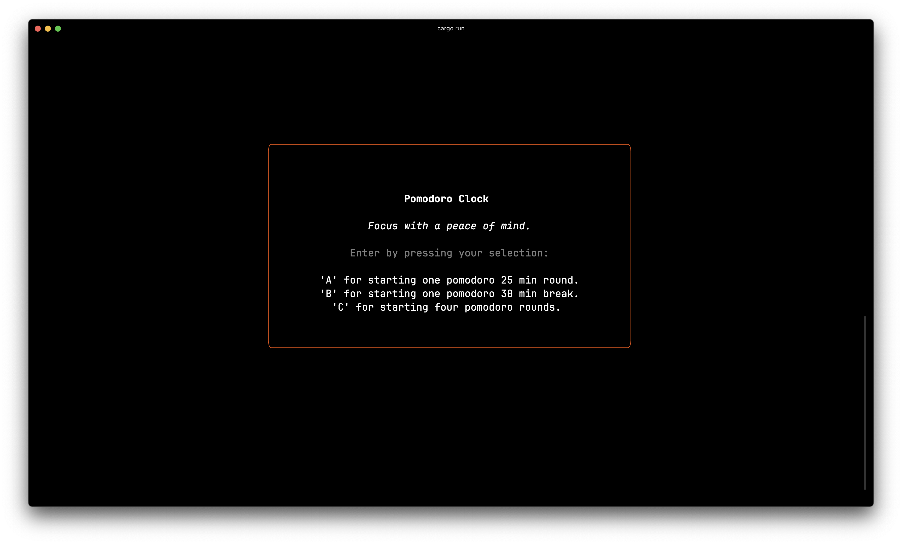
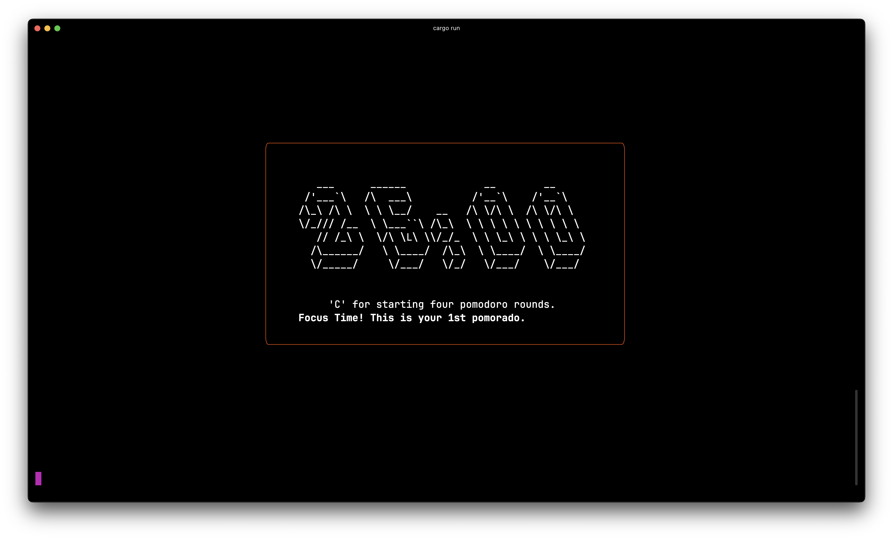
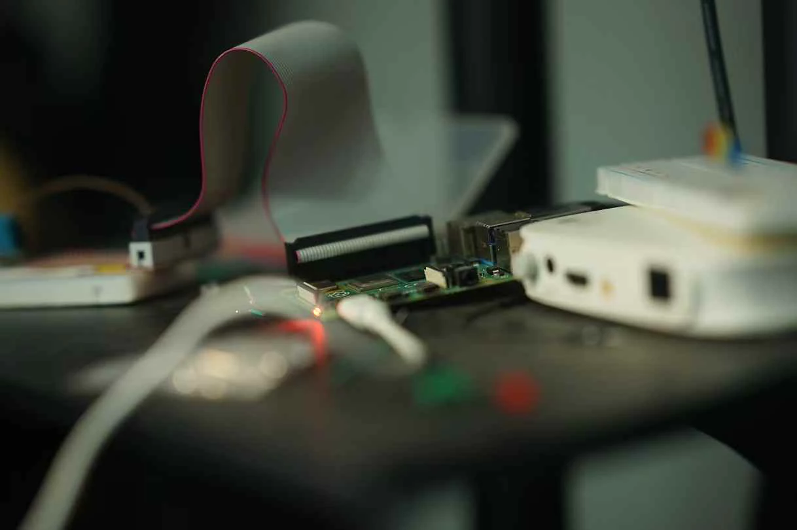

# Hello from Shanghai 👋

Hi! I'm Sean, an enthusiastic software engineer. Check out [my blog~](https://makabaka1880.xyz). I use ARM MacOS for daily dev, and I mostly do full stack projects on my own or with other friends.

When I'm not coding, you can find me diving into music, martial arts, or the depths of theoretical computer science.

## Featured Projects
Check our some of my interesting projects:

### 🧠 PyLambda
A Python implementation of the [Simple Untyped Lambda Calculus](https://makabaka1880.xyz/CS/theoretical/lambdacalculus.html). Delves into the foundational concepts of functional programming and serves as a playground for experimenting with lambda expressions.

### 🎹 Overture
A terminal UI rendering middleware in Rust. Overture serves as a prelude to more complex rendering tasks, providing a solid foundation for building text-based user interfaces.

## 🔧 Tech Stack
- **Backend** NodeJS (Express.js), Swift Vapor, SQLite3, MongoDB
- **Frontend** Barebones HTML, EJS, rich.py, SwiftUI
- **Theoretical** Rust, Haskell, ASM
- **Deploying** RaspberryPi(does that even count lol), Docker
- **Currently Learning** Rust, C++, PostgreSQL

---

Feel free to explore my repositories for more projects and insights. Let's connect and collaborate!

