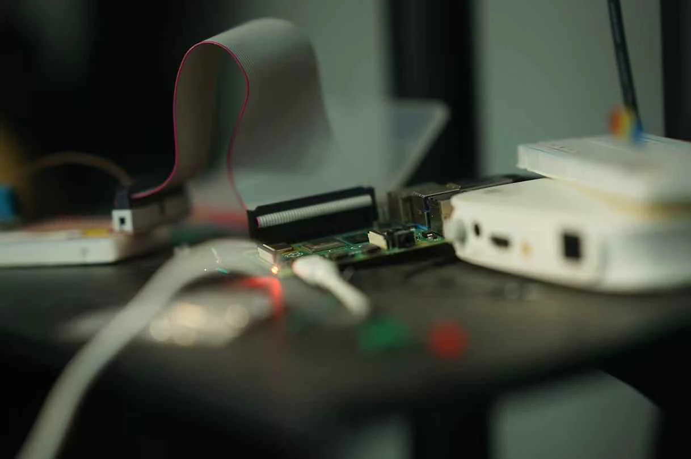

# Hello from Shanghai 👋

Hi! I'm Sean, a Chinese high school student, as well as an enthusiastic software engineer. Check out [my blog~](https://blog.makabaka1880.xyz). I use ARM MacOS for daily dev, and I mostly do full stack projects on my own or with other friends.

When I'm not coding, you can find me diving into music, martial arts (former athelete, not anymore sadly), or the depths of theoretical computer science.

Server maintainance, all projects are halted. For further info, please contact [admin@makabaka1880.xyz](mailto:admin@makabaka1880.xyz)

## 🔧 Tech Stack
- **Frontend** NuxtJS, VueJS, EJS, SwiftUI
- **Backend** Gin-Gonic, NodeJS (Express.js), Swift Vapor, SQLite3, PostgreSQL, MongoDB
- **Competitive Programming** C++,
- **Research** Rust, Haskell, Lean, Python, R, ASM
- **Maintainence** RaspberryPi(does that even count lol), Docker

---

Feel free to explore my repositories for more projects and insights. Let's connect and collaborate!

