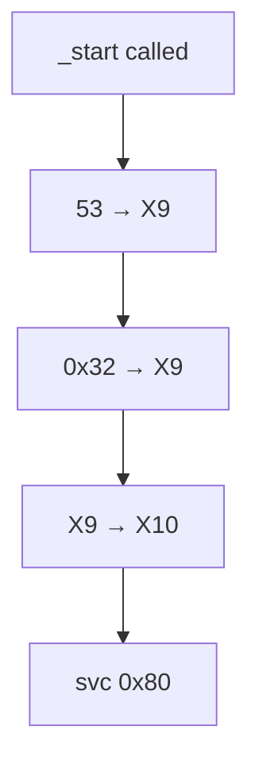

# Hello World!

::: warning Warning
These tutorials are only for AArch64 mach-o systems, thus Apple Silicon macs. It is recommended that readers have a basic understanding of C or C++, since I will use a lot of C syntax to explain
:::

Everything starts with a hello world.

## 0. Source Code Overview

First of all, here's the source code:

```asm
.global _start
.align 4


_start: mov X0, #1
        adr X1, helloworld
        mov X2, hellolen
        mov X16, #4
        svc #0x80

        mov X0, #0
        mov X16, #1
        svc #0x80


helloworld: .ascii "Hello World!\n"
hellolen = . - helloworld
```

Assembly language directly interacts with the hardware, which eliminates the possibility of using high-level methods such as `print` in Python or `std::cout` in C++. This means we need to directly communicate with the kernel and direct the string from creation to stdout.

## 1. Walkthrough

### 1x00 Overall Structure

The program is divided into three sections:

::: tabs

@tab Initialization
This section defines the global entry point (`_start`) and ensures proper alignment for the code.
```asm
.global _start
.align 4
```

@tab Main Program
This is the main execution logic. It outputs “Hello World!” to the screen and then exits the program.
```asm
_start: mov X0, #1          ; File descriptor 1 (stdout)
    adr X1, helloworld      ; Load address of the string into X1
    mov X2, hellolen        ; Length of the string
    mov X16, #4             ; System call number for write
    svc #0x80               ; Make the system call

    mov X0, #0              ; Exit code 0
    mov X16, #1             ; System call number for exit
    svc #0x80               ; Make the system call
```

@tab Data Section
This section defines the `helloworld` label, which stores the “Hello World!” string.
```asm
helloworld: .ascii "Hello World!\n"
hellolen = . - helloworld
```
:::

### 1x01 Initialization

Let's look at the first lines:

```asm
.global _start
.align 4
```

The first line declares the `_start` label as global. This is not the same as [variable scopes](/CS/cpp/variables), as it ensures that the assembler and linker can access the label.

::: tip Labels
Labels in assembly are **identifiers** that mark specific locations in your code. They represent memory addresses and can be referenced to jump or point to instructions or data. Labels can imply:
- **Definition**: A label is written as `name:` (e.g., `_start:`). 
- **Reference**: Instructions like `b` (branch) or `adr` (address register) can use labels to point to these locations.
- **Scope**: Labels can be local (within one file) or global (accessible across files, marked with `.global`).

Common usage includes:
1. **Entry Point**: `_start:` is a label used as the program entry point.
2. **Data Reference**: Labels like `helloworld:` point to memory locations where data (e.g., strings) are stored.
3. **Control Flow**: Labels can be targets for branching (e.g., loops or conditionals).

:::

Here, `_start` is declared as the entry point of the program, similar to `int main()` in C++ or `if __name__ == "__main__"` in Python.

The `.align 4` ensures that the following label or data is aligned to a **4-byte boundary**. In assembly, alignment means arranging data in memory at addresses that are multiples of a specified power of 2 (in this case, $2^2 = 4$).


Aligned addresses make random accesses easier, as they just require an index multiplication `addr = index * 4` (`.align 4`) or `addr = index * 8` (`.align 8`).

For unaligned memory, when accessing unaligned memory, the CPU may require multiple memory fetches and additional processing to retrieve the correct data. The CPU may need to fetch data from two memory locations and combine the results (depending on the memory width).

For example, accessing a 4-byte integer starting at `0x03` might require reading part of the data from `0x00`–`0x03` and part from `0x04`–`0x07`.

### 1x02 Main Program

The `_start` block could be broken down into two sections: the first section printing the string and the second one in charge of cleanup.

Let's start with the printing part, and go through it line by line.

```asm
_start: mov X0, #1
```

Here, `_start` is defined. `_start` does not need to be explicitly called, as it is the entry point of the program. This is similar to defining `int main()` in C++.

::: important Stylization Choices
There are actually more differences between AArch64 and x86_64 assembly than just syntax, registers, and calls. In AArch64, label definitions are often put on the same line as the first instruction, whereas in x86_64, they are put on a new line.
::: code-tabs#asm
@tab AArch64
```asm
_start: mov X0, #1
        adr X1, helloworld
        ...
```

@tab x86_64
```asm
_start:
    mov X0, #1
    adr X1, helloworld
    ...
```
:::

The `mov` instruction copies the value of one register into another. Here's two examples:

```asm
_start: mov X9, #53     ; Stores the value 53 into register X9
        mov X9, #0x32   ; Overrides X9 to value 50
        mov X10, X9     ; Copies the value of X9 into X10
```



The register `X0` is the first argument. This register will be used by the `svc` instruction as the first argument to a system call. In this specific case, `X0` represents the **file descriptor** for the write system call.

File descriptors are standard numerical values representing input/output streams:
| Value | Descriptor              |
|-------|-------------------------|
| 0     | `STDIN` Standard Input  |
| 1     | `STDOUT` Standard Output|
| 2     | `STDERR` Standard Error |
| ≥3    | Other pipes and files   |

> Therefore, `mov X0, #1` meant storing the value 1 into the register `X0`, thus using STDOUT for whatever i/o the operation is going to do next.

::: tip Registors
Here are some other registers in the Unix system. A cheatsheat can be found [here](/CS/asm/registers)
1. **Caller-Saved Registers (`X0-X15`):** These are used for passing arguments and temporary data. The caller must save their values if needed after the function call.
2. **Callee-Saved Registers (`X19-X28`):** These are preserved across function calls, meaning the called function must save and restore them if it modifies their values.
3. **Special Purpose (`X16`, `X17`, `X29`, `X30`):** Reserved for specific tasks like branching, stack management, and function returns.
:::

Then here's the second line
```asm
adr X1, helloworld
```

The `adr` instruction stores helloworld's address. This is because the cpu isn't capable of storing the whole string. Passing address is quite common, such as `scanf("%s", &num)` in C. Actually, when using stdin, it's almost the same.

X1 is the second parameter for a function call, which, here is data to be outputed into the STDOUT stream.

```asm
mov X2, hellolen
```

X2 here stores the length of the data to be printed. `hellolen` is a var that contained the length of `helloworld`.

```asm
mov X16, #4
```

The `X16` register is for system calls. After setting this and sending a [supervisor call](#supervisor-call), the kernel reads it and decides what to do. Other system call numbers see [this chart](/CS/asm/syscalls). Here, we'll be sending a write operation, thus 4.

<div id="supervisor-call"></div>

```asm
svc #0x80
```

The `svc` instruction sends a **supervisor call**. 

::: tip Supervisor Calls
The svc instruction sends a **supervisor call**, which causes the processor to switch from user mode (or another less-privileged mode) to supervisor mode (or another more-privileged mode). This allows the operating system to perform privileged operations on behalf of the user program. An exception is raised, and the CPU transfers control to an exception handler in the operating system.
The specific action taken by the kernel depends on the value stored in a register (usually X16) and potentially other arguments passed in general-purpose registers. The system call #0x80 is normally used in **mach-o** systems for normal supervisor calls.

```asm
_start: mov #0, op_number   ; Set up op type
        ...                 ; Sets up input params and calls other blocks
        svc #0x80           ; Supervisor call
```
:::

Here, the first section of the program is done, thus printing the string with the following parameters:
- **X0 = 1** Writes to STDOUT
- **X1 = &helloworld** Output what is on the address of `helloworld`
- **X2 = hellolen** Output `hellolen` bytes starting from `&helloworld`.

The printing is done, but valid return status should be given. Therefore 

```asm
mov X0, #0
```

Was called, which set the first argument to 0. Here, the first argument will be used later as an **exit code**.

```asm
mov X16, #1
```

Told the kernel that the system operation should be exit, and therefore `X0` should be intepreted as the exit code.

```asm
svc #0x80
```

Called a SVC, which gracefully ended the program.

```zsh
as helloworld.s -o helloworld.o     # Assemble the code
ld -o helloworld helloworld.o -lSystem -syslibroot `xcrun -sdk macosx --show-sdk-path` -e _start -arch arm64    # Link the source code
```
If you see any permission issues whilst running, execute

```zsh
chmod +x helloworld
```

Now, run the program.
```zsh
./helloworld.exec
Hello World!
```

Congrats on your first Hello to the AArch64 Mach-O ASM World!