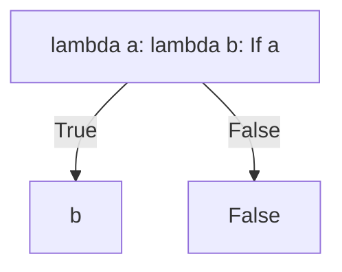

# λ演算入门

::: tip 写在前面
学这个主要是因为我们社团准备要规范一些写代码的习惯以及结构 确定了OOP以及函数化编程后在寻找适合函数化编程的伪代码规范的时候决定恶补一下底层知识

本文适合对于计算机科学与代数有一定了解的同学
:::

## 0x01 Notations

Assume a mathematical function $f(x) = x^2$. It can be denoted as a map:
$$ f: x \mapsto x^2$$

Lambda calculus is all about the manipulation of functions, so the definition of functions is necessary. In lambda calculus, functions are called λ-abstractions:

::: info Definition
**λ-Abstractions** represents anonymous singled-valued functions. Consider a map $x \mapsto M$ then a equivalent λ-abstraction could be defined as
$$ \lambda x .\ M $$
Where $x$ is the **bound variable** and $M$ the **body**. In modern programming languages, $x$ is also known as the **input parameter**.
:::

Thus our squaring function $f$ could be defined using a lambda abstraction:
$$ \lambda x .\ x^2 $$

::: warning Warning
Note that the abstraction $(\lambda x .\ x^2)$ is not equivalent of the following py3 function:

```python
def f(x):
    return x ** 2
```

$x^2$ is the **body** of the abstraction. In λ-calculus, there's no concept as to return values; an abstraction is only a mathematical object. Analogy:
- Functions in languages are like ​calculators (produce values immediately).
- λ-abstractions are like ​equations (preserve structure for formal manipulation).

Instead, python and many other languages have a built-in lambda syntax:

```python
(lambda x: x ** 2) # Defines a lambda function that squares
(lambda x: x ** 2) (2) # Outputs 4
```
:::

## 0x02 Reductions

λ-abstractions could be manipulated. Consider the previous python lambda function:

```python
(lambda x: x ** 2)
```

It represents a λ-abstraction $(\lambda x .\ x^2)$. One can notice that changing the bound variable of the abstraction does not change the essence of the map, ie whether the abstraction is called $(\lambda y .\ y^2)$ or $(\lambda \star .\ \star^2)$ it is always equivalent to our initial abstraction. Therefore we define **α-conversion** as follows:

::: tip Definition
**α-conversions** is a operation on a λ-abstraction to change the bound variable. For an abstraction with bound variable x and body M:
$$(\lambda x .\ M)\ \to_{\alpha}\ (\lambda y .\ M)$$
is an α-conversion.

An example would be to da an α-conversion on our previous python lambda expression.

```python
>>> f1 = (lambda x: x ** 2) # Original Function
>>> f2 = (lambda y: y ** 2) # Alpha-conversion done
>>> assert f1 (2) == f2 (2) # Check for equivalence
True
```
:::

Functions on their own aren't of much use. To utilize a function, **function applications** come in:

::: tip Definition
**β-reduction** is a function application where a specific value is being computed using a λ abstraction. For a given abstration with bound variable x and body M:
$$(\lambda x .\ M) N\ \to_{\beta}\ M[N/x]$$

For example, consider the algebriac function $f(x) = x^2$ and computing $f(3)$, the equivalent in lambda calculus would be 
$$(\lambda x .\ x^2)\ 3\ \to_{\beta}\ x^2[3/x] = 3^2 = 9$$

Let's try that out on our previous function.
```python
>>> f = (lambda x: x ** 2)
>>> f (2) # Applies 2 to the parameter x, thus computing x ** 2 [2/x]
4
```

Note that lambda calculus is **completely symbolic**, therefore numerical operations are not allowed. The squaring example is included purely for demonstration.
:::

Until here, one limitation of lambda abstractions is shown: they are single-valued functions. However, the higher-order property of lambda abstractions allows them to recieve **functions** as inputs. Consider the following implementation of binary addition:

$$
(\lambda x .\ (\lambda y .\ (x + y)))\ M\ N\ \\
\downarrow_{\beta} \\
(\lambda y .\ (x + y)\ [x/M])\ N\ \\
\downarrow_{\beta} \\
(x + y)\ [x/M]\ [y/N] = M + N
$$

It implements something called **currying**, named after the logician Haskell Curry. The brackets are included only for easier understanding; the lambda abstract itself could be written as follows:
$$\lambda x .\ \lambda y .\ x + y$$

::: tip Implementation
In python, a curried lambda function could also be implemented as follows:

```python
(lambda x: lambda y: x + y) (1) (2) # Outputs 3
```
:::

## 0x03 Encoding
The lambda calculus is pretty primitive as for now. However, according to the **Church-Turing thesis**, this functional programming language is **Turing Complete**, thus capable of anything a modern programming language is.

Let's see some implementations of features in modern languages.

### Booleans and Conditionals

In lambda calculus, all computation is expressed through function abstraction and application. We can define Boolean values as selector functions:

$$
\text{True} = \lambda x .\ \lambda y .\ x \\
\text{False} = \lambda x .\ \lambda y .\ y
$$

If one extract any one of these lambda functions into a python named function, it looks like this:

```python
def true(x, y):
    x()

def false(x, y):
    y()
```

It is already obvious that these are control-flow statements. They might seemed hard-coded, but try seeing it from a perspective when they are *variables*.

The conditional operator can be implemented as:

$$ \text{If} = \lambda b .\ \lambda x .\ \lambda y .\ b\ x\ y $$

Reduction Examples:

$$
\begin{align*}
    \text{If}\ \text{True}\ M\ N\ &\to_{\beta}\ (\lambda b .\ \lambda x .\ \lambda y .\ b\ x\ y)\ \text{True}\ M\ N \\
    &\to_{\beta}\ (\lambda x .\ \lambda y .\ \text{True}\ x\ y)\ \ M\ N \\
    &\to_{\beta}\ (\lambda y .\ \text{True}\ M\ y)\ N \\
    &\to_{\beta}\ \text{True}\ M\ N \\
    &\to_{\beta} \text{True}\ [M/x] [N/y] \\
    &\to_{\beta} (\lambda x .\ \lambda y .\ x)\ M\ N \\
    &\to_{\beta} (\lambda y .\ M)\ N  \\
    &\to_{\beta} M
    &= M \\
\end{align*}
$$

$$
\begin{align*}
    \text{If}\ \text{False}\ M\ N\ &\to_{\beta}\ (\lambda b .\ \lambda x .\ \lambda y .\ b\ x\ y)\ \text{False}\ M\ N \\
    &\to_{\beta}\ (\lambda x .\ \lambda y .\ \text{False}\ x\ y)\ \ M\ N \\
    &\to_{\beta}\ (\lambda y .\ \text{False}\ M\ y)\ N \\
    &\to_{\beta}\ \text{False}\ M\ N \\
    &\to_{\beta} \text{False}\ [M/x] [N/y] \\
    &\to_{\beta} (\lambda x .\ \lambda y .\ y)\ M\ N \\
    &\to_{\beta} (\lambda y .\ y)\ N  \\
    &\to_{\beta} N
    &= M \\
\end{align*}
$$

Therefore a valid control-flow statement has been implemented. By this logic, even a switch statement with finite number of branches can be implemented. For example, a ternary switch-case control selector could be implemented. 

First, the cases/branches need to be defined:

$$
\text{A} = \lambda x .\ \lambda y .\ \lambda z .\ x \\
\text{B} = \lambda x .\ \lambda y .\ \lambda z .\ y \\
\text{C} = \lambda x .\ \lambda y .\ \lambda z .\ z \\
$$

Then the conditional itself:

$$
\text{Selector} = \lambda s .\ \lambda x .\ \lambda y .\ \lambda z\ s\ x\ y\ z
$$

Then the selector can be called as

$$
\text{Selector}\ \text{A}\ a\ b\ c\ \to_{\beta}\ A [a/x] [b/y] [c/z] = x \\
\text{Selector}\ \text{B}\ a\ b\ c\ \to_{\beta}\ B [a/x] [b/y] [c/z] = y \\
\text{Selector}\ \text{C}\ a\ b\ c\ \to_{\beta}\ C [a/x] [b/y] [c/z] = x \\
$$

Here's an implementation in python;

```python
>>> A = (lambda x: lambda y: lambda z: x)
>>> B = (lambda x: lambda y: lambda z: y)
>>> C = (lambda x: lambda y: lambda z: z)
>>> Selector = (lambda s: lambda x: lambda y: lambda z: s (x) (y) (z))

>>> Selector (A) ('a') ('b') ('c')
'a'

>>> Selector (B) ('a') ('b') ('c')
'b'

>>> Selector (C) ('a') ('b') ('c')
'c'
```

### Boolean Operations

Once we have the boolean operations written, boolean operants could be easily implemented. For example, not could switch into two branches based on the value of the bound variable:

$$ \text{Not} = \lambda s .\ \text{If}\ s\ \text{False}\ \text{True} $$

And could be implemented through a brute-force check of combination of bound vars:

$$
\text{And} = \lambda a .\ \lambda b .\ (b\ \text{False})
$$



Further more, the $\text{If}$ statement can be ommited completely:

::: info Proof
**Lemma.** Any application of the form $\text{If}\ s\ a\ b$ is equivalent to $s\ a\ b$.

Perform a $\beta$-reduction on the application:

$$
\begin{align*}
\text{If}\ s\ a\ b &\to_{\beta} ((\lambda b .\ \lambda x .\ \lambda y .\ b\ x\ y)\ [s/b])\ x\ y \\
&\to_{\beta} (\lambda x .\ \lambda y .\ s\ x\ y)\ [a/x]\ [b/y] \\
&\to_{\beta} s\ a\ b
\end{align*}
$$
:::

Other binary operands $(\lambda a .\ \lambda b .\ M)$ can be implemented similarly:

| Operand | $M$ |
| - | - |
| $\text{AND}$ | $a\ b\ \text{False}$ |
| $\text{OR}$ | $a\ \text{True}\ b$ |
| $\text{XOR}$ | $a\ (\text{Not}\ b)\ b$ |
| $\text{NAND}$ | $a\ (\text{Not}\ b)\ \text{True}$ |

## Appendix: Cheatsheet

### Boolean Constants
#### T (True)
- **Lambda Abstraction**:  
  $$ \lambda a .\, \lambda b .\, a $$
- **Python Implementation**:  
  ```python
  T = lambda a: lambda b: a
  ```
- **Effect**:  
  Selects first argument:  
  $$ \text{T}\ a\ b \to a $$
- **Example**:  
  ```python
  >>> T ("T") ("F") 
  "T"
  ```

#### F (False)
- **Lambda Abstraction**:  
  $$ \lambda a .\, \lambda b .\, b $$
- **Python Implementation**:  
  ```python
  F = lambda a: lambda b: b
  ```
- **Effect**:  
  Selects second argument:  
  $$ \text{F}\ a\ b \to b $$
- **Example**:  
  ```python
  >>> F ("T") ("F") 
  "F"
  ```

---

### Unary Boolean Gates

#### NOT
- **Lambda Abstraction**:  
  $$ \lambda s .\, s\ \text{F}\ \text{T} $$
- **Python Implementation**:  
  ```python
  NOT = lambda s: s (F) (T)
  ```
- **Effect**:  
  $$ 
  \begin{align} 
  \lnot \text{T} &\to \text{F} \\ 
  \lnot \text{F} &\to \text{T} 
  \end{align}
  $$
- **Example**:  
  ```python
  >>> NOT (T) ("T") ("F") 
  "F"
  ```

---

### Binary Boolean Operations

#### AND
- **Lambda Abstraction**:  
  $$ \lambda a .\, \lambda b .\, a\ b\ \text{F} $$
- **Python Implementation**:  
  ```python
  AND = lambda a: lambda b: a (b) (F)
  ```
- **Effect**:  
  $$ a \land b = \begin{cases} 
  \text{T} & \text{if } a = \text{T}, b = \text{T} \\ 
  \text{F} & \text{otherwise} 
  \end{cases} $$
- **Example**:  
  ```python
  >>> AND (T) (F) ("T") ("F") 
  "F"
  ```

#### OR
- **Lambda Abstraction**:  
  $$ \lambda a .\, \lambda b .\, a\ \text{T}\ b $$
- **Python Implementation**:  
  ```python
  OR = lambda a: lambda b: a (T) (b)
  ```
- **Effect**:  
  $$ a \lor b = \begin{cases} 
  \text{T} & \text{if } a = \text{T} \text{ or } b = \text{T} \\ 
  \text{F} & \text{otherwise} 
  \end{cases} $$
- **Example**:  
  ```python
  >>> OR (F) (T) ("T") ("F") 
  "T"
  ```

#### NAND
- **Lambda Abstraction**:  
  $$ \lambda a .\, \lambda b .\, a\ (\text{NOT}\ b)\ \text{T} $$
- **Python Implementation**:  
  ```python
  NAND = lambda a: lambda b: a (NOT (b)) (T)
  ```
- **Effect**:  
  $$ \lnot(a \land b) $$
- **Example**:  
  ```python
  >>> NAND (T) (T) ("T") ("F") 
  "F"
  ```

#### NOR
- **Lambda Abstraction**:  
  $$ \lambda a .\, \lambda b .\, a\ \text{F}\ (\text{NOT}\ b) $$
- **Python Implementation**:  
  ```python
  NOR = lambda a: lambda b: a (F) (NOT (b))
  ```
- **Effect**:  
  $$ \lnot(a \lor b) $$
- **Example**:  
  ```python
  >>> NOR (F) (F) ("T") ("F") 
  "T"
  ```

#### XOR
- **Lambda Abstraction**:  
  $$ \lambda a .\, \lambda b .\, a\ (\text{NOT}\ b)\ b $$
- **Python Implementation**:  
  ```python
  XOR = lambda a: lambda b: a (NOT (b)) (b)
  ```
- **Effect**:  
  $$ a \oplus b = \begin{cases} 
  \text{T} & \text{if } a \neq b \\ 
  \text{F} & \text{otherwise} 
  \end{cases} $$
- **Example**:  
  ```python
  >>> XOR (T) (F) ("T") ("F") 
  "T"
  ```

---

### Key Conventions
1. All operations are **curried**: `AND (T) (F)` not `AND(T, F)`
2. Church booleans act as **selectors**:  
   $$ \text{T}\ a\ b \to a \quad \text{F}\ a\ b \to b $$
3. Primitive definitions:  
   ```python
   T = lambda a: lambda b: a  # Church TRUE
   F = lambda a: lambda b: b  # Church FALSE
   ```