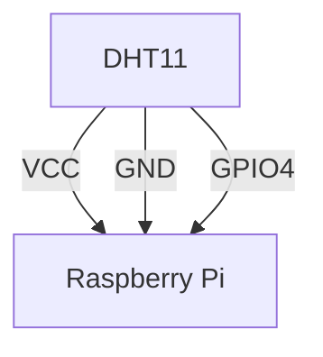

# Raspi 4B读取DHT11的神奇方法

前两天搞到一个树莓派，性质冲冲的开始玩

然后开始研究GPIO引脚

我有好多个之前做项目剩下的DHT11:


然后就开始研究能不能搞一个监控机房温湿度的东西

接线图:



我的服务器上大概是这样的：
- **前端** [Node.js](nodejs.org) PORT 80 项目中有index.html及其他web页面的源代码
- **后端** [Node.js](nodejs.org) PORT 80 接管最简单的API，比如文件上传POST或者通告GET
- **嵌入式后端** Flask.py PORT 3000 用来广播/控制GPIO

## 0x00 Adafruit的DHT库

这种方法是最常见的一种, 配置起来很简单

首先先搭建一个虚拟环境

::: tip 虚拟环境
**虚拟环境 Virtual Environment(venv)** 是一个方便版本管理的方案。每一个venv中的解释器/编译器版本不一样，安装的库也不一样。
:::

```zsh
cd backend  # working dir
python -m venv dht11  # create venv
source ./dht11/bin/activate  # activate venv
```

然后开始安装

```zsh
python3 -m pip install adafruit-circuitpython-dht # Installation
```

然后就可以用啦

::: code-tabs#python

@tab dht11_backend.py
```py
import time
import board
import adafruit_dht

dht_device = adafruit_dht.DHT11(board.D4)    # Depends on your config

def temp():
    return dht_device.temperature

def hum():
    return dht_device.humidity
```

@tab main.py
```py
import dht11_backend as dht
from flask import Flask, request, jsonify
from flask_cors import CORS

app = Flask(__name__)
CORS(app, origins='*', methods=['POST', 'OPTIONS'], supports_credentials=True)

@app.route('/temp-hum', methods=['GET', 'OPTIONS'])
def hum_temp():
    if request.method == 'OPTIONS':
        # CORS preflight handling for OPTIONS request
        response = jsonify({'status': 'success'})
        response.headers['Access-Control-Allow-Origin'] = '*'
        response.headers['Access-Control-Allow-Methods'] = 'POST, OPTIONS'
        response.headers['Access-Control-Allow-Headers'] = 'Content-Type'
        return response, 200
    print("CALLED: DHT11")
    temp = dht.temp()
    hum = dht.hum()
    print(temp, hum)
    return jsonify({"temp": temp, "hum": hum}), 200
```
:::


但是这种方法有个很大的缺点：Adafruit的库对系统的clock很敏感，也就是说当我把它挂在后台用tmux的话很快就会挂掉。这时候就需要一些新办法了

## 0x01 Node.js

因为我的服务器有一部分是NodeJS做的后端，所以理论上是可以用的。
查了查npm：


确实可行

```zsh
npm i node-dht-sensor
```

然后在`server.js`当中添加这几行:

```js
const sensor = require('node-dht-sensor');
...
// Middleware
sensor.initialize({
  test: false,
  model: 11,    // Switch to 22 if you're using a dht22
  pin: 4,       // I used GPIO4, but all other avaliable ones are ok
});
...
app.get('/temp-hum', (req, res) => {
  const { temperature, humidity } = sensor.read();

  if (!isNaN(temperature) && !isNaN(humidity)) {
    res.json({
      temperature: temperature.toFixed(2),
      humidity: humidity.toFixed(2),
    });
  } else {
    console.error("Err: Failed to read sensor");
    res.status(500).json({
      error: "Failed to read data from the sensor.",
    });
  }
});
```

这样确实也行，但用JS这种高级语言来访问底层传感器的做法总感觉不太好

## 0x02 直接访问

在逛遍全网之后，我还研究出了一种神奇的方法。Raspi有一种神奇的机制，叫Overlay。在其的README当中，有这一段


所以我们只要在`/boot/firmware/config.txt`当中`[all]`后面加上这一段

```bootconfig
dtoverlay=dht11,gpiopin=4
```

然后

```zsh
sudo reboot
```

就行了

重启之后，我们进入这个文件夹`/sys/devices/platform/dht11@4/iio:device0/`,然后里面就会有很多文件

```tree
├── in_humidityrelative_input
├── in_temp_input
├── name
├── of_node -> ../../../../firmware/devicetree/base/dht11@4
├── power
│   ├── autosuspend_delay_ms
│   ├── control
│   ├── runtime_active_time
│   ├── runtime_status
│   └── runtime_suspended_time
├── subsystem -> ../../../../bus/iio
├── uevent
└── waiting_for_supplier

4 directories, 10 files
```
里面的`in_humidityrelative_input`和`in_temp_input` 存储的就是1000倍的温湿度数据:

```zsh
cd /sys/devices/platform/dht11@4/iio:device0/
cat in_humidityrelative_input # Ex 45.8% outputs 45800
cat in_temp_input # Ex 24.3ºC outputs 24300
```
因此也可以写出一个这样的较为稳定的API:

::: code-tabs#python

@tab dht11_backend.py
```
import time
import board
import adafruit_dht

dht_device = adafruit_dht.DHT11(board.D4)    # Depends on your config

def temp():
    return dht_device.temperature

def hum():
    return dht_device.humidity
```

:::

### 0x03 总结
现在总共有三种方式来获取DHT传感器的数据的方法:


| 方法 | 优点 | 缺点 |
| --- | --- | --- |
| Adafruit | 成熟方案 | 刷新机制敏感 |
| NodeJS | 简单好用 | 前端访问后端 |
| 直接获取 | 稳定 | 配置麻烦 |