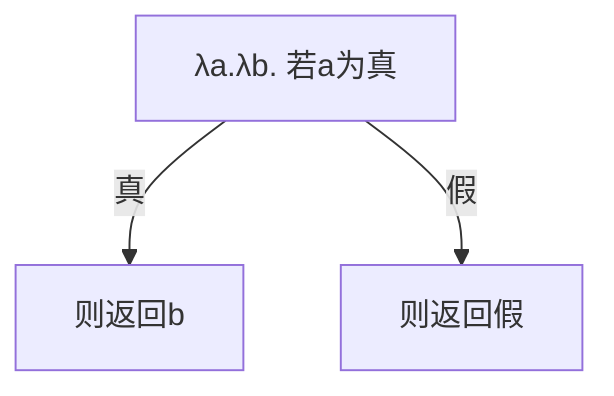

# λ演算入门

::: tip 写在前面
学这个主要是因为我们社团准备要规范一些写代码的习惯以及结构 确定了OOP以及函数化编程后在寻找适合函数化编程的伪代码规范的时候决定恶补一下底层知识

本文适合对于计算机科学与代数有一定了解的同学 最好是python 我文中就先用py的lambda expression来做的implementation

我自己做了个$\lambda$-calculus的演算器，可以来玩玩 [网站](https://pylambda.makabaka1880.xyz) [GitHub](https://github.com/makabaka1880/PyLambda)

结尾有[Cheatsheet](#appendix-cheatsheet)哈～
:::

## 0x01 记法

考虑函数$f(x) = x^2$. 我们可以把它写做一个函数：
$$ f: x \mapsto x^2$$

Lambda演算就是完全围绕函数及其运算展开的，因此函数的定义是必要的。在Lambda演算中，函数被称为lambda抽象：

::: info 定义 1.0
**λ抽象 (Lambda Abstraction)** 表示单值匿名函数。对于映射关系 $x \mapsto M$，其等价的λ抽象定义为：
$$ \lambda x .\ M $$
其中 $x$ 称为**绑定变量**，$M$ 称为**函数体**。在现代编程语言中，$x$ 也被称作**输入参数**。
:::

因此此前的函数可以写作：
$$ \lambda x .\ x^2 $$

::: warning 主意
虽然它们的类型等价，但是 $(\lambda x .\ x^2)$ 与下面这个函数不是一样的：

```python
def f(x):
    return x ** 2
```

$x^2$是这个抽象的**函数体**，是这个函数的值。在编程语言中，f(x)在未带入前是无意义的，但是在lambda演算中我们的抽象体是有具体意义的

- 变成语言中的函数更像是计算器，可以给你直接算出答案
- lambda抽象是草稿纸上的过程，它们保留了代数结构以便推导

值得注意的是Python等语言中也有定义匿名函数的方法：

```python
(lambda x: x ** 2) # Defines a lambda function that squares
(lambda x: x ** 2) (2) # Outputs 4
```
:::
## 0x02 操作与规约

抽象体可以参与运算。考虑先前的结构体：

```python
(lambda x: x ** 2)
```

它表示一个λ抽象 $(\lambda x .\ x^2)$。我们可以注意到，改变抽象的绑定变量并不会改变映射的本质。也就是说，无论抽象被命名为 $(\lambda y .\ y^2)$ 还是 $(\lambda \star .\ \star^2)$，它始终等价于我们最初的抽象。因此我们定义**α转换**如下：

::: info 定义
**α转换**是对λ抽象改变其绑定变量的操作。对于一个具有绑定变量x和函数体M的抽象：
$$(\lambda x .\ M)\ \to_{\alpha}\ (\lambda y .\ M)$$
就是一个α转换。

以下是在我们之前的Python lambda表达式上进行α转换的示例：

```python
>>> f1 = (lambda x: x ** 2) # 原始函数
>>> f2 = (lambda y: y ** 2) # 完成α转换
>>> assert f1(2) == f2(2) # 验证等价性
True
```
:::

函数本身并不直接发挥作用。要实际运用函数，就需要进行**函数应用**：

::: info 定义
**β规约**是指使用λ抽象计算特定值的函数应用过程。对于具有绑定变量x和函数体M的抽象：
$$(\lambda x .\ M) N\ \to_{\beta}\ M[N/x]$$

例如，考虑代数函数 $f(x) = x^2$ 计算 $f(3)$，在λ演算中等价为：
$$(\lambda x .\ x^2)\ 3\ \to_{\beta}\ x^2[3/x] = 3^2 = 9$$

让我们在前面的函数上实际验证：
```python
>>> f = (lambda x: x ** 2)
>>> f(2)  # 将2应用于参数x，即计算 x**2 [2/x]
4
```

需要注意的是，λ演算是**完全符号化的**，因此不允许直接进行数值运算。平方运算示例仅用于演示目的。
:::

至此，λ抽象的一个限制显现出来：它们都是单参函数。然而，λ抽象的高阶特性允许它们接受**函数**作为输入。考虑以下二元加法的实现：

$$
(\lambda x .\ (\lambda y .\ (x + y)))\ M\ N\ \\
\downarrow_{\beta} \\
(\lambda y .\ (x + y)\ [x/M])\ N\ \\
\downarrow_{\beta} \\
(x + y)\ [x/M]\ [y/N] = M + N
$$

这种技术称为**柯里化**(Currying)，以逻辑学家Haskell Curry的名字命名。括号仅用于便于理解；λ抽象本身可简写为：
$$\lambda x .\ \lambda y .\ x + y$$

::: tip 实现
在Python中，柯里化的λ函数可以这样实现：

```python
(lambda x: lambda y: x + y)(1)(2)  # 输出3
```
:::

尽管嵌套函数似乎要求严格的参数顺序，但在柯里化函数中并非如此。
以下是对引理证明和布尔值编码的专业中文翻译：

---

::: info 证明
**引理.** 形式为 $f = \lambda x.\ \lambda y.\ M(x, y)$ 和 $g = \lambda y.\ \lambda x.\ M(y, x)$ 的任意两个抽象是等价的。  
**证明.** 对 f 和 g 进行α转换：  
$$
\begin{align*}
f &= \lambda x .\ \lambda y.\ M(x, y) \\
&\to_{\alpha}^{x \to a} \lambda a .\ \lambda y.\ M(a, y) \\
&\to_{\alpha}^{y \to b} \lambda a .\ \lambda b.\ M(a, b) \\
\end{align*}
$$
$$
\begin{align*}
g &= \lambda y .\ \lambda x.\ M(y, x) \\
&\to_{\alpha}^{y \to a} \lambda a .\ \lambda x.\ M(a, x) \\
&\to_{\alpha}^{x \to b} \lambda a .\ \lambda b.\ M(a, b) \\
\end{align*}
$$

因此 $f \equiv g$。

<QED/>

:::

## 0x03 编码实现
目前的λ演算还相当原始。但根据**邱奇-图灵论题**(Church-Turing thesis)，这种函数式编程语言是**图灵完备的**，因此能够实现任何现代编程语言的功能。

让我们看看现代语言中某些特性的λ演算实现。

### 布尔值与条件表达式

在λ演算中，所有计算都通过函数抽象和应用来表达。我们可以将布尔值定义为选择函数：

$$
\text{True} = \lambda x .\ \lambda y .\ x \\
\text{False} = \lambda x .\ \lambda y .\ y
$$

如果将这些λ函数转化为Python命名函数，其形式如下：

```python
def true(x, y):
    return x  # 总是选择第一个参数

def false(x, y):
    return y  # 总是选择第二个参数
```

显然，这些函数实现了条件选择的功能。它们看起来像是硬编码的，但如果将它们视为*变量*，就能理解其通用性。

条件运算符可如下实现：

$$ \text{If} = \lambda b .\ \lambda x .\ \lambda y .\ b\ x\ y $$

规约示例：

$$
\begin{align*}
    \text{If}\ \text{True}\ M\ N\ &\to_{\beta}\ (\lambda b .\ \lambda x .\ \lambda y .\ b\ x\ y)\ \text{True}\ M\ N \\
    &\to_{\beta}\ (\lambda x .\ \lambda y .\ \text{True}\ x\ y)\ \ M\ N \\
    &\to_{\beta}\ (\lambda y .\ \text{True}\ M\ y)\ N \\
    &\to_{\beta}\ \text{True}\ M\ N \\
    &\to_{\beta} \text{True}\ [M/x] [N/y] \\
    &\to_{\beta} (\lambda x .\ \lambda y .\ x)\ M\ N \\
    &\to_{\beta} (\lambda y .\ M)\ N  \\
    &\to_{\beta} M
\end{align*}
$$

$$
\begin{align*}
    \text{If}\ \text{False}\ M\ N\ &\to_{\beta}\ (\lambda b .\ \lambda x .\ \lambda y .\ b\ x\ y)\ \text{False}\ M\ N \\
    &\to_{\beta}\ (\lambda x .\ \lambda y .\ \text{False}\ x\ y)\ \ M\ N \\
    &\to_{\beta}\ (\lambda y .\ \text{False}\ M\ y)\ N \\
    &\to_{\beta}\ \text{False}\ M\ N \\
    &\to_{\beta} \text{False}\ [M/x] [N/y] \\
    &\to_{\beta} (\lambda x .\ \lambda y .\ y)\ M\ N \\
    &\to_{\beta} (\lambda y .\ y)\ N  \\
    &\to_{\beta} N
\end{align*}
$$

通过上述规约过程，我们实现了有效的条件控制流。基于此原理，甚至可以创建具有有限分支的switch语句。例如，我们可以实现一个三路选择器：

首先定义分支选择函数：
$$
\text{A} = \lambda x .\ \lambda y .\ \lambda z .\ x \quad \text{(选择第一参数)} \\
\text{B} = \lambda x .\ \lambda y .\ \lambda z .\ y \quad \text{(选择第二参数)} \\
\text{C} = \lambda x .\ \lambda y .\ \lambda z .\ z \quad \text{(选择第三参数)} \\
$$

然后定义选择器核心：
$$
\text{Selector} = \lambda s .\ \lambda x .\ \lambda y .\ \lambda z\ s\ x\ y\ z
$$

选择器调用过程：
$$
\begin{align*}
\text{Selector}\ \text{A}\ a\ b\ c\ &\to_{\beta}\ A\ a\ b\ c = a \\
\text{Selector}\ \text{B}\ a\ b\ c\ &\to_{\beta}\ B\ a\ b\ c = b \\
\text{Selector}\ \text{C}\ a\ b\ c\ &\to_{\beta}\ C\ a\ b\ c = c
\end{align*}
$$

Python实现示例：
```python
>>> A = (lambda x: lambda y: lambda z: x)  # 总是返回第一个参数
>>> B = (lambda x: lambda y: lambda z: y)  # 总是返回第二个参数
>>> C = (lambda x: lambda y: lambda z: z)  # 总是返回第三个参数
>>> Selector = (lambda s: lambda x: lambda y: lambda z: s(x)(y)(z))

>>> Selector(A)('a')('b')('c')  # 选择第一个分支
'a'

>>> Selector(B)('a')('b')('c')  # 选择第二个分支
'b'

>>> Selector(C)('a')('b')('c')  # 选择第三个分支
'c'
```
### 布尔运算

在定义了基本布尔值后，布尔运算符可以轻松实现。例如，"非"运算通过切换两个分支来实现：

$$ \text{Not} = \lambda s .\ \text{If}\ s\ \text{False}\ \text{True} $$

"与"运算则通过暴力检查绑定变量组合实现：

$$
\text{And} = \lambda a .\ \lambda b .\ a\ b\ \text{False}
$$



更进一步，$\text{If}$ 语句可以被完全省略：

::: info 证明框
**引理.** 任何形式为 $\text{If}\ s\ a\ b$ 的应用等价于 $s\ a\ b$。  
**证明.** 对应用进行β规约：

$$
\begin{align*}
\text{If}\ s\ a\ b &\to_{\beta} ((\lambda b .\ \lambda x .\ \lambda y .\ b\ x\ y)\ [s/b])\ a\ b \\
&\to_{\beta} (\lambda x .\ \lambda y .\ s\ x\ y)\ a\ b \\
&\to_{\beta} s\ a\ b
\end{align*}
$$

<证毕/>

:::

其他二元运算符 $(\lambda a .\ \lambda b .\ M)$ 可类似实现：

| 运算符 | 实现 $M$ | 逻辑描述 |
|--------|----------|----------|
| $\text{AND}$ | $a\ b\ \text{False}$ | a真时取b，否则取假 |
| $\text{OR}$ | $a\ \text{True}\ b$ | a真时取真，否则取b |
| $\text{XOR}$ | $a\ (\text{Not}\ b)\ b$ | a真时取非b，否则取b |
| $\text{NAND}$ | $a\ (\text{Not}\ b)\ \text{True}$ | a真时取非b，否则取真 |

更多实现详见[速查表](#binary-boolean-operations)

### 邱奇数码


## 附录：λ演算速查表

### 布尔常量
#### T (真值)
- **λ抽象表示**:  
  $$ \lambda a .\, \lambda b .\, a $$
- **Python实现**:  
  ```python
  T = lambda a: lambda b: a
  ```
- **效果**:  
  选择第一个参数:  
  $$ \text{T}\ a\ b \to a $$
- **示例**:  
  ```python
  >>> T ("真") ("假") 
  "真"
  ```

#### F (假值)
- **λ抽象表示**:  
  $$ \lambda a .\, \lambda b .\, b $$
- **Python实现**:  
  ```python
  F = lambda a: lambda b: b
  ```
- **效果**:  
  选择第二个参数:  
  $$ \text{F}\ a\ b \to b $$
- **示例**:  
  ```python
  >>> F ("真") ("假") 
  "假"
  ```

---

### 一元布尔门

#### 非门 (NOT)
- **λ抽象表示**:  
  $$ \lambda s .\, s\ \text{F}\ \text{T} $$
- **Python实现**:  
  ```python
  NOT = lambda s: s (F) (T)
  ```
- **效果**:  
  $$ 
  \begin{align} 
  \lnot \text{T} &\to \text{F} \\ 
  \lnot \text{F} &\to \text{T} 
  \end{align}
  $$
- **示例**:  
  ```python
  >>> NOT (T) ("真") ("假") 
  "假"
  ```

---

### 二元布尔运算

#### 与门 (AND)
- **λ抽象表示**:  
  $$ \lambda a .\, \lambda b .\, a\ b\ \text{F} $$
- **Python实现**:  
  ```python
  AND = lambda a: lambda b: a (b) (F)
  ```
- **效果**:  
  $$ a \land b = \begin{cases} 
  \text{T} & \text{当 } a = \text{T}, b = \text{T} \\ 
  \text{F} & \text{其他情况} 
  \end{cases} $$
- **示例**:  
  ```python
  >>> AND (T) (F) ("真") ("假") 
  "假"
  ```

#### 或门 (OR)
- **λ抽象表示**:  
  $$ \lambda a .\, \lambda b .\, a\ \text{T}\ b $$
- **Python实现**:  
  ```python
  OR = lambda a: lambda b: a (T) (b)
  ```
- **效果**:  
  $$ a \lor b = \begin{cases} 
  \text{T} & \text{当 } a = \text{T} \text{ 或 } b = \text{T} \\ 
  \text{F} & \text{其他情况} 
  \end{cases} $$
- **示例**:  
  ```python
  >>> OR (F) (T) ("真") ("假") 
  "真"
  ```

#### 与非门 (NAND)
- **λ抽象表示**:  
  $$ \lambda a .\, \lambda b .\, a\ (\text{NOT}\ b)\ \text{T} $$
- **Python实现**:  
  ```python
  NAND = lambda a: lambda b: a (NOT (b)) (T)
  ```
- **效果**:  
  $$ \lnot(a \land b) $$
- **示例**:  
  ```python
  >>> NAND (T) (T) ("真") ("假") 
  "假"
  ```

#### 或非门 (NOR)
- **λ抽象表示**:  
  $$ \lambda a .\, \lambda b .\, a\ \text{F}\ (\text{NOT}\ b) $$
- **Python实现**:  
  ```python
  NOR = lambda a: lambda b: a (F) (NOT (b))
  ```
- **效果**:  
  $$ \lnot(a \lor b) $$
- **示例**:  
  ```python
  >>> NOR (F) (F) ("真") ("假") 
  "真"
  ```

#### 异或门 (XOR)
- **λ抽象表示**:  
  $$ \lambda a .\, \lambda b .\, a\ (\text{NOT}\ b)\ b $$
- **Python实现**:  
  ```python
  XOR = lambda a: lambda b: a (NOT (b)) (b)
  ```
- **效果**:  
  $$ a \oplus b = \begin{cases} 
  \text{T} & \text{当 } a \neq b \\ 
  \text{F} & \text{其他情况} 
  \end{cases} $$
- **示例**:  
  ```python
  >>> XOR (T) (F) ("真") ("假") 
  "真"
  ```

---

### 关键约定
1. 所有运算均为**柯里化形式**：`AND (T) (F)` 而非 `AND(T, F)`
2. Church布尔值作为**选择器**工作：  
   $$ \text{T}\ a\ b \to a \quad \text{F}\ a\ b \to b $$
3. 基础定义：  
   ```python
   T = lambda a: lambda b: a  # Church真值
   F = lambda a: lambda b: b  # Church假值
   ```
  