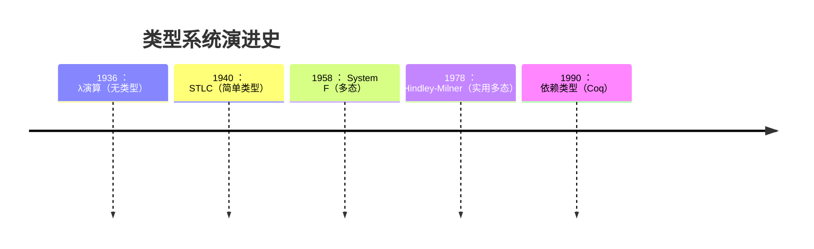
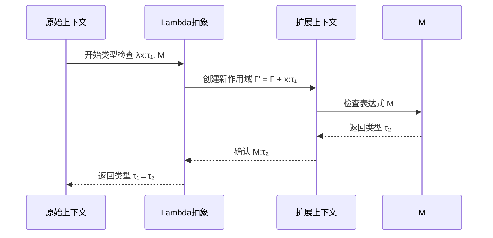

# 0x02 简单类型Lambda演算系统 - 函数式类型系统

::: tip 本节术语 | Glossary
- [**图灵机 (Turing's machine)**](#turings-machine) 利用无限长的纸带和读写头搭建的计算模型
- [**λ演算 (The Lambda Calculus)**](#lambda-calculus) 利用无限长的纸带和读写头搭建的计算模型
- [**邱奇 - 图灵 论题 (Church - Turing Hypothesis)**](#church-turing) 即图灵机与Lambda演算等价
- [**简单类型λ演算 (STLC)**](#stlc) 一种带有简单chaining的类型系统
- [**上下文 (Context)**](#context) 关联变量及其类型的数据结构
- [**作用域 (Scope)**](#scope) 一种在程序语言中<Anchor>上下文</Anchor>的实现
- [**类型判断 (Type Judgement)**](#type-judgement) 通过类型系统来验证程序的合理性
:::



让我们把时间拨回100年前。

二战时期，英国出现了一位数学家叫**图灵**:


他发明了个特别著名的模型叫<Anchor id="turings-machine">**图灵机**</Anchor> —— 通过无限长的纸带和读写头，精确定义了"可计算性"的概念。

::: details 图灵机
**图灵机 (Turing Machine)** 是艾伦·图灵1936年提出的计算模型，由以下组件构成：

```math
M = (Q, \Sigma, \Gamma, \delta, q_0, q_{\text{accept}}, q_{\text{reject}})
```

| 组件               | 符号          | 说明                          |
|--------------------|---------------|-------------------------------|
| **状态集**         | $Q$           | 有限状态集合                  |
| **输入字母表**     | $\Sigma$      | 允许的输入符号集合            |
| **纸带字母表**     | $\Gamma$      | $\Sigma \subset \Gamma$       |
| **转移函数**       | $\delta$      | $Q \times \Gamma \to Q \times \Gamma \times \{L,R\}$ |
| **初始状态**       | $q_0 \in Q$   | 计算起始点                    |
| **接受状态**       | $q_{\text{accept}}$ | 计算成功终止状态          |
| **拒绝状态**       | $q_{\text{reject}}$ | 计算失败终止状态          |

1. **读写头** 扫描纸带当前单元格
2. 根据 **当前状态$q_i$** 和 **读取符号$s$** 查表
3. 执行 $\delta(q_i, s) = (q_j, s', D)$：
   - 将状态改为 $q_j$
   - 写入符号 $s'$ 到当前单元格
   - 按方向 $D$ (左移`L`/右移`R`)移动读写头
:::


但鲜为人知的是，他的导师美国数学家**阿隆佐·邱奇（Alonzo Church）** 提出了另一种等效的计算模型：<Anchor id="lambda-calculus">Lambda Calculus</Anchor>.

::: details λ演算
**λ演算 (Lambda Calculus)** 是阿隆佐·邱奇(Alonzo Church)在1930年代提出的形式系统，构成了函数式编程的理论基础。

[深入探索λ演算 →](/CS/theoretical/lambdacalculus)

其核心只有三条语法规则：

```bnf
<表达式> ::= <变量>                 (变量)
          | λ<变量>.<表达式>       (抽象)
          | <表达式> <表达式>      (应用)
```

| 概念       | 表示           | 示例                     | 说明               |
|------------|----------------|--------------------------|--------------------|
| **α转换**  | $\lambda x.\ M \to \lambda y.\ M[x:=y]$ | $\lambda x.\ x \to \lambda y.\ y$    | 变量重命名         |
| **β归约**  | $(\lambda x.\ M)\ N \to M[x:=N]$ | $(\lambda x.\ x)\ y \to y$   | 函数应用           |
| **η变换**  | $\lambda x.\ (M\ x) \to M$      | $\lambda x.\ (f\ x) \to f$   | 函数等价简化       |

其重要的特性包含
1. **图灵完备**：可表达任何可计算函数
2. **无类型系统**：原始版本无类型约束
3. **柯里化**：多参函数转化为嵌套λ：  
   `f(x,y) = x+y` ⇨ `λx.λy.x+y`

在现实中，其应用包括
- 函数式语言核心(Haskell/Lisp)
- 编程语言理论基石
- 编译器优化基础

:::

总而言之，他发现只用函数，居然也能完成所有图灵机所可以做的运算；这就是大名鼎鼎的<Anchor id='church-turing'>邱奇 - 图灵 论题 (Church - Turing Hypothesis)</Anchor>。
但是这个东西有个缺陷：lambda演算毫无安全性可言，正如图灵机的类型只有其字母表一样。尽管这样可以实现类似c++当中用指针当泛型的神奇操作，但还是太不实用了。于是在不久后，邱奇就提出了<Anchor id="stlc">STLC (Simply-Typed Lambda Calculus)</Anchor>.

::: danger 建议
一下内容将建立在读者熟悉λ演算的前提上。若读者未了解过其，建议先学习一下函数式编程或者λ演算
[学习λ演算 →](/CS/theoretical/lambdacalculus)
:::

我们先从一个简单的函数来看吧:

$$\lambda x.\ x$$

我们再来确认一下类型是什么吧：类型应该要像变量一样，可以被命名、组合和传递，用来描述数据的结构和性质，从而保证程序的安全性和正确性。我们在STLC中一般用$t$或者$\tau$来代表类型。

在lambda演算中，我们一般只会标注绑定变量的类型：

$$ \lambda x^\tau.\ x $$

当然 我们还有一种特殊的类型叫<Anchor id="function-type">函数类型 (Function Types)</Anchor>。它们描述的是函数输入和输出的数据类型，使得函数不仅仅是代码块，而是带有明确接口和行为规范的值。比如说，我们刚刚那个lambda抽象也有类型。因为定义的输入是$\tau$，而且输出和输入一样，所以我们就可以认为这个函数的类型是

$$\tau \to \tau$$

那毕竟是要写程序嘛，类型系统首先需要知道你写的每个变量的类型是啥。这时我们需要一个<Anchor id="context">**上下文 (Context)**</Anchor>。数学上来说，是我们的程序当中所有绑定变量$x$与其类型$\tau$所形成的有序对的集合:
$$\Gamma = \{(x, \tau) | \forall x\}$$

当然对于软件工程师来说可能这样更好理解一点：

```python
context = {x: type(x) for x in variables}
```

它干的是啥呢？就是把每一个在这个范围内的变量还有他的类型拉了一张表。（现在很多的解释器和编译器也会那么干）

而我们一般这样来表示一个有序对：
```swift
let x: τ;
```
等价于
$$x:\tau \in \Gamma$$

在软件工程中，上下文的概念实现为<Anchor id="scope">**作用域 (Scope)**</Anchor>。大多数语言都有作用域：

::: tabs
@tab Swift
```swift
let a = 10;
let _: Int = {
    let b = 20;
    type(of: a);    // Int.Type = Int
    type(of: b);    // Int.Type = Int
}()
type(of: a);        // Int.Type = Int
type(of: b);        // Error: cannot find 'b' in scope
```

@tab ECMAScript / JS
```js
const a = 10;
{
    const b = 20;
    typeof a;       // 'number'
    typeof b;       // 'number'
}
typeof a;           // 'number'
typeof b;           // undefined
```

@tab Haskell
```hs
let x = 10 in
  let x = 20 in
    print x  -- prints 20
-- Outer x still refers to 10 in other expressions
```
:::

最常见的作用域就是函数定义了，我们在函数里面的参数啊、定义的变量啊在出了函数定义的作用域之后就无法再次使用了：

```python
def add(a, b):
    sum = a + b
    return sum

a, b = 1, 2
c = add(a, b)
print(a, b, c)  # All global, defined under context Γ
print(sum)      # NameError: sum is defined in the scope of the function declaration, and is not reachable outside that scope.
```

而我们可以根据上下文来进行<Anchor id='type-judgement'>**类型判断 (Type Judgement)**</Anchor>:

$$\Gamma \vdash x:\tau$$
即

```swift
assert(type(x) == τ.Type)
```
简单来说，就是判断一个项 / 变量$x$的类型是否为$\tau$.

因此，获取刚刚那个抽象$\lambda x^\tau.\ x$的类型可以表示为
$$ \Gamma \vdash (\lambda x^\tau.\ x) : \tau \to \tau $$
一般来说，我们在STLC中解决的问题都是求解一个对象的类型。接下来，我们介绍三条对于STLC我们常用的Type Check规则。

::: warning 记法风格约定
在接下来的逻辑推理与类型证明中，我们将交替使用以下三种常见的记法风格：

> 说明：本教材默认使用 **形式推理**（自然演绎）风格进行主要推导，必要时补充其它格式以增强理解。

::: tabs

@tab 初等证明格式
用于日常数学中的条件推导，适合简明陈述前提与结论：

$$
\begin{align*}
&\because\ a > b,\ \text{且}\ b > c \\
&\therefore\ a > c
\end{align*}
$$

@tab 递等式推导
常用于 λ-演算、类型变换等语法结构的推导，强调等价关系：

$$
\begin{align*}
(\lambda y.\ \lambda x.\ x)\ f
&\to^{\beta} (\lambda x.\ x)[f / y] \\
&= \lambda x.\ x \equiv I
\end{align*}
$$

@tab 形式推理（自然演绎）
强调结构化地描述推理规则，适合系统化描述类型演绎：

$$
\dfrac{
    \Gamma \vdash a \to b \quad \Gamma \vdash b \to c
}{
    \Gamma \vdash a \to c
}
$$

:::


## I. 变量规则
$$\dfrac{x:\tau \in \Gamma}{\Gamma \vdash x : \tau}$$

这条规则说的是，假设我们有一个变量，类型为$\tau$, 且这条记录在context中，那么context中一定x对应$\tau$。看似是废话，但实际上说明了**变量的类型取决于上下文**，这也就是静态类型语言的要求。

::: tip 工程应用
若我们在一个上下文中声明了
```swift
var id: Int;
```
那我们就能保证操作
```swift
id += 1;
```
是类型安全操作，因为在这个上下文的所有地方，`x`的类型都是`Int`，不会突然变成`Bool`或者其他类型。

之所以没有保证这是安全操作就是因为可能`Int`会溢出或者遇到其他软件工程错误，但这不是这篇文章的范畴了
:::
## II. 抽象规则
$$\dfrac{(\Gamma + x:\tau_1) \vdash M : \tau_2}{\Gamma \vdash (\lambda x:\tau_1. M) : \tau_1 \to \tau_2}$$

翻译成自然语言就是：如果对于上下文$\Gamma$拓展成一个新的上下文$\Gamma'$，并在其中定义了$x$的类型为$\tau_1$，同时这种情况下$M$的类型为$\tau_2$，那么$\lambda x.\ M$在$\Gamma'$的类型就是$\tau_1 \to \tau_2$.

对于实际应用来说，这种拓展可以在一个作用域内看作建立一个新的作用域，这里用swift的闭包做演示：

```swift
// Context Γ
var a: SomeType  // Global variable in context Γ

// Define a lambda abstraction: λx: τ1. M
// This is a *function value* of type τ1 → τ2, assigned to the variable `lambda_x_dot_M`
let lambda_x_dot_M: (τ1) -> τ2 = { (x: τ1) -> τ2 in
    // In extended context Γ' = Γ ∪ {x: τ1}, we define M of type τ2
    let M: τ2 = someOp(x)  // some operation that uses x to produce a τ2
    return M               // return M, so the function maps τ1 input to τ2 output
}
```

Swift的闭包内可以看作一个继承了所有全局的上下文中的类型信息，也就是说在闭包`lambda_x_dot_M`当中，`a`也有`SomeType`类型。但是闭包内的上下文($\Gamma$)完全是一份独立于全局上下文的副本($\Gamma'$)，所以在这里面添加的信息都无法在外部获得。


在现实中，写这种闭包还是不够直观。所以一般我们会使用<Anchor id="procedural">**封装函数 (Procedurals)**</Anchor>来保证开发效率的同时使用<Anchor id="side-effect">**副作用 (Side-effects)**</Anchor>来提高程序效率。这可能会牺牲程序安全性，但这点风险在现实工程实现中完全可以忽略不计。

::: tabs
@tab Swift
```swift
func equivalent_of_lambda_x_dot_M(x: τ1) -> τ2 {    // Function takes in a parameter of type τ1
    let M: τ2 = someOp(x); return M; // Computes something to return sth of type τ2
}
```

@tab C++
```cpp
τ2 equivalent_of_lambda_x_dot_M(τ1 x) {
    τ2 M = someOp(x); return M;
}
```
:::

总体来说，抽象规则可以如下进行：



::: tip 工程应用
假设我们需要一个加密凯撒码的方法。我们假设前端已经预先过滤掉了不合理的输入，后端现在所需要进行的操作就是将它们全部进行相应的位移。
```c
void encryptString(char *s, int shift) {
    for (int i = 0; s[i] != '\0'; i++) {
        char base = isupper(s[i]) ? 'A' : 'a';
        s[i] = (s[i] - base + shift) % 26 + base;
    }
}
```
不难发现，我们先前一直以为是类型不安全的C语言实际上可以通过其他的约束来实现安全性。由于其字符与整形几乎完全等价，C在此时甚至能提供更多的便利性。在实际软件工程学中，我们对于安全性的保证不仅仅是对于语言本身的类型系统的要求；更是架构以及程序的优良设计的需求。
:::

## III. 应用规则
$$
\dfrac{
    \Gamma \vdash f:\ \tau_1 \to \tau_2 \quad \Gamma \vdash x:\ \tau_1
} {
    \Gamma \vdash f (x):\ \tau_2
}
$$
在自然语言当中，这说明如果有一个函数f有类型$\tau_1 \to \tau_2$, 那么将其作用于一个项$x:\ \tau_1$上将会得到一个类型为$\tau_2$的项。这很好理解吧，一个吃进去$\tau_1$吐出来$\tau_2$的函数，吃进去了一个$\tau_1$一定会吐出来$\tau_2$。

还是用Swift闭包做演示：

```swift
func f(_ param: τ1) -> τ2 {
    return someOp(param)        // This value is gaurunteed by the compiler to be of type τ2
}

let x: τ1 = .someValueOfTau1    // Ad-hoc constructor only for demonstration
let M = f(for: x); type(of: M)  // type is τ2
```

::: tip 工程应用
假设我们通过`enum`定义了一个和类型(Sum Type)`Department`, 它有三个值：`.admin`, `.engineering`, `.product`, 那么通过定义以下函数我们就可以保证一个对于任意部门都输出合理输出的描述函数：
```swift
enum Department {
    case admin
    case engineering
    case product
}

let description: (Department) -> String = { (department: Department) -> String in
    switch department {
    case .admin:
        return "Administrative department coordinates the entire group."
    case .engineering:
        return "Engineering department is the core of developing new products"
    case .product:
        return "Product department ensures the market value of the groups' products"
    }
}
```
这个闭包的类型是 Department -> String，说明对于每个输入值 Department，它都能返回一个确定的 String 类型的输出。这种映射在类型系统中是严格静态可检查的 —— 只要输入的类型是 Department，输出就一定是 String，符合应用规则中的 $\tau_1 \to \tau_2$ 类型约束。

更进一步，由于 Department 是一个封闭的枚举类型（和类型），其所有可能的构造子都已在类型定义中列明，因此 switch 语句在本质上就是对 $\tau_1$ 的所有可能情况进行穷尽分析（exhaustive matching）。也就是说，表达式 $M$ 在 $\lambda x^{\tau_1}.\ M$ 中不会在任何合法输入下失败，因此整个函数的类型 $\tau_1 \to \tau_2$ 是可验证且总是安全的。

在后续的章节中，我们会了解到由于 Department 是一个封闭的枚举（和）类型，其所有可能的构造子在类型定义中已经列出，因此 switch 语句本质上就是对 $\tau_1$ 的所有可能值进行“语义完备”的处理，使得 $\lambda x^{\tau_1}.\ M$ 的 M 不会在任何合法输入下失效，从而确保整个函数的类型是 严格可验证的 $\tau_1 \to \tau_2$。
:::

## IV. 应用
在现实情况中，STLC的逻辑被LSP Server、 linter以及编译器所广泛使用。让我们来看看一个编译器是如何验证一个函数类型的吧：
```swift
let identityTwice: (Int) -> Int { (x: Int) ->
    let id: (Int) -> Int = { $0 };
    return id(id(x))
}
```
我们在里面看到两个类型声明：
  1. $\Gamma \vdash \text{identityTwice}:\ \text{Int} \to \text{Int}$
  2. $\Gamma \vdash \text{id}:\ \text{Int} \to \text{Int}$

我们来依次证明吧！首先，我们可以将这个闭包写成一个lambda抽象体：
$$\text{identityTwice} = \lambda x^{\text{Int}}.\ \text{id}(\text{id}(x))$$

我们先来分析$\text{id}$. 

$$\text{id} = \lambda x^{\text{Int}}.\ x$$
熟悉lambda演算的同学应该一眼就可以看出来这是恒等函数，会原样返回本来输入的项。因此，其输入和返回应该是一样的，所以第二条声明是合理的。

我们接下来来分析这个闭包本身。我们进入内部，声明一个拓展上下文：
$$\Gamma' = \Gamma + x:\ \text{Int}$$

我们再来看本来的抽象体
$$\text{identityTwice} = \lambda x^{\text{Int}}.\ \text{id}(\text{id}(x))$$

**引理 1.** 对于$\forall x:\ \text{Int} \in \Gamma,\ \Gamma \vdash \text{id}(x):\ \text{Int}$.
证明. 
$$
\dfrac{
    \dfrac{
       ( \Gamma \vdash id: \text{Int} \to \text{Int}) \quad (\Gamma' \subset \Gamma)
    } {
        \Gamma' \vdash id: \text{Int} \to \text{Int}
    }
    \quad
    \Gamma' \vdash x:\text{Int}
}{
    \Gamma' \vdash \text{id}(x):\text{Int}
}
$$ 
<QED />

**引理2.** $\text{identityTwice}$与$\text{id}$等价

证明. 我们可以对着这个双层id一通展开：

$$
\begin{align*}
\text{identityTwice} &= \lambda x^{\text{Int}}.\ \text{id}(\text{id}(x)) \\
&= \lambda x^{\text{Int}}.\ (\lambda y^{\text{Int}}.\ y)((\lambda z^{\text{Int}}.\ z)(x)) \\
&\to^{\beta} \lambda x^{\text{Int}}.\ (\lambda y^{\text{Int}}.\ y)(x) \\
&\to^{\beta} \lambda x^{\text{Int}}.\ x \equiv \text{id}
\end{align*}
$$
<QED />
注意到，$\text{id}$的类型是`int -> int`, 所以$\text{identityTwice}$的类型也是`int -> int`。证毕。
<QED />

优雅～

## V. 结语

在前面的讨论中，我们通过分析 identityTwice 函数，深入理解了简单类型λ演算（STLC）如何通过类型系统确保函数的行为符合预期。通过类型判断规则，我们能够验证函数是否类型安全，避免了运行时错误。

然而，STLC 只是类型系统的起点。随着我们对类型系统的深入了解，我们将探索更强大的类型系统，如 Hindley-Milner 类型系统，它为多态性提供了强有力的支持，使得函数可以处理多种类型的输入。

在接下来的章节中，我们将进一步探讨不同种类的类型，包括：

- **代数数据类型 (Algebraic Data Types)** 和类型与积类型结合产生的魔法
- **泛型与继承 (Generics and Inheritence)** 通过定义一个模版类型来保证其他衍生类型的安全性
- **参数化多模态 (Parametric Polymorphism)** 通过定义 / 限定一个类型的类型的变量来作为类型的参数

通过这些扩展，我们将看到类型系统如何在编程语言中发挥更大的作用，不仅提高代码的安全性和可维护性，还能提升程序的表达能力和灵活性。