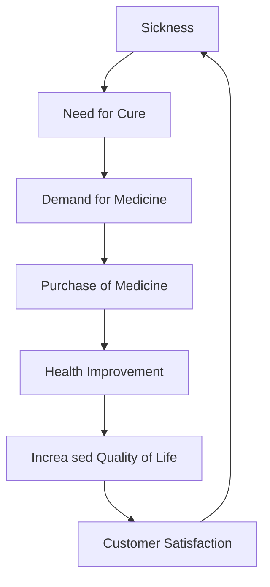
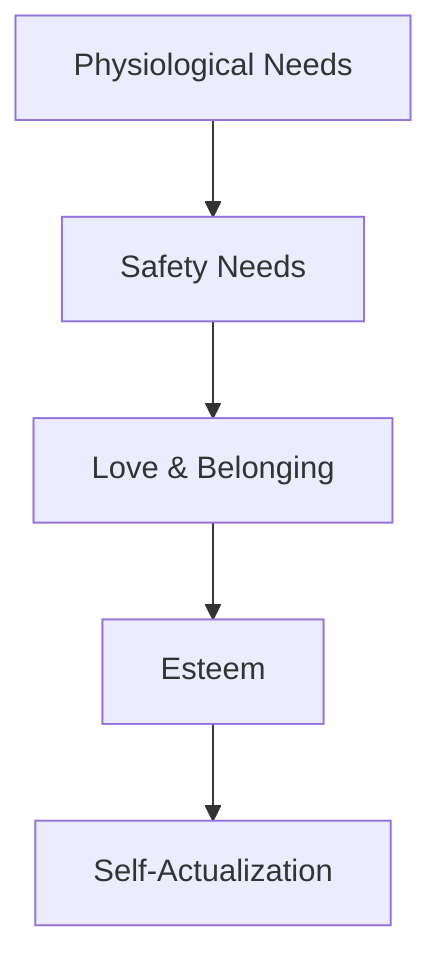

# Group Disc. #1 Notes

## Intro

::: info DEF
**DEMAND**: The need for a solution or product that addresses a specific problem or fulfills a particular desire in the market. 
> What does the market need? What problem are we solving?
:::

Demands vary.
- Does it solve my problem?
- Does it make my life easier?
- Does it make me happier?

::: tip Deepseek
People tend to buy things that actually solves a problem, not just sth that looks good / looks cool. Ex
:::

::: info Def
**Maslow' Laws** describe a hierarchy of needs that motivates human behavior, ranging from basic physiological needs to self-actualization.

:::

## 5 Steps of Design Thinking

DT is a proccess to solve problems and create solutions that are human-centered, iterative, and collaborative. It involves understanding the needs of users, defining the problem, ideating solutions, prototyping, and testing.

### 1. Empathize
Understand the needs, desires, and challenges of the users. This involves observing and engaging with users.
- Forms
- Interviews
- Surveys

### 2. Define
Clearly articulate the problem you are trying to solve. This involves synthesizing the information gathered during the.
1. State the problem
2. Define the target audience
3. Identify the constraints and requirements

::: tip Gemini
Gemini supports a feature called Deep Research that enabes users to conduct in-depth research on a topic by providing a comprehensive overview of the subject matter, including key concepts, historical context, and current trends.

:::